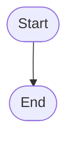
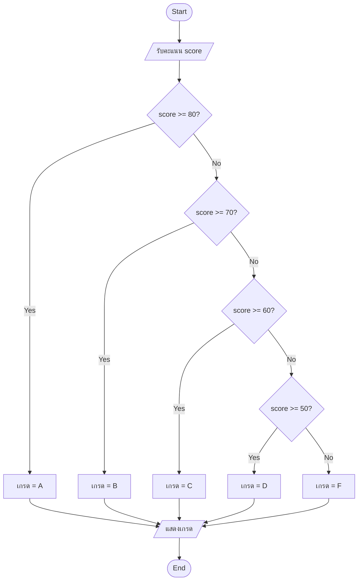
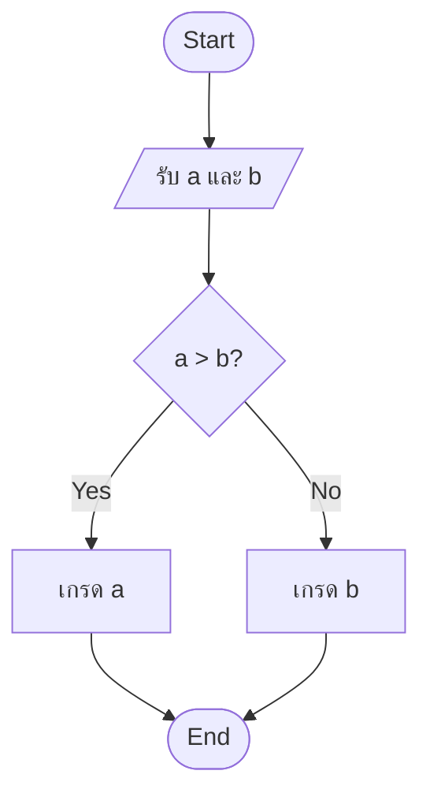
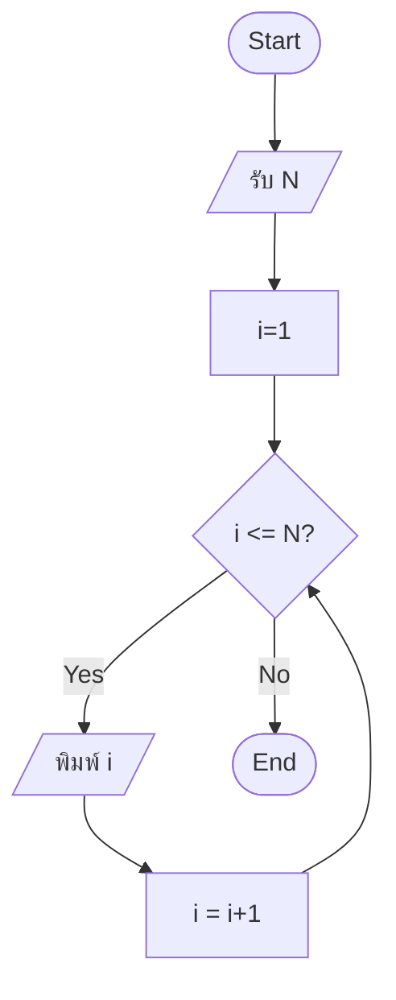

โจทย์ A — ตรวจสอบเกรด



โจทย์ B— หาค่าสูงสุดจาก 2 ตัวเลข



โจทย์ C — นับ 1 ถึง N



```

```


<style>#mermaid-1782719082597{font-family:sans-serif;font-size:16px;fill:#333;}@keyframes edge-animation-frame{from{stroke-dashoffset:0;}}@keyframes dash{to{stroke-dashoffset:0;}}#mermaid-1782719082597 .edge-animation-slow{stroke-dasharray:9,5!important;stroke-dashoffset:900;animation:dash 50s linear infinite;stroke-linecap:round;}#mermaid-1782719082597 .edge-animation-fast{stroke-dasharray:9,5!important;stroke-dashoffset:900;animation:dash 20s linear infinite;stroke-linecap:round;}#mermaid-1782719082597 .error-icon{fill:#552222;}#mermaid-1782719082597 .error-text{fill:#552222;stroke:#552222;}#mermaid-1782719082597 .edge-thickness-normal{stroke-width:1px;}#mermaid-1782719082597 .edge-thickness-thick{stroke-width:3.5px;}#mermaid-1782719082597 .edge-pattern-solid{stroke-dasharray:0;}#mermaid-1782719082597 .edge-thickness-invisible{stroke-width:0;fill:none;}#mermaid-1782719082597 .edge-pattern-dashed{stroke-dasharray:3;}#mermaid-1782719082597 .edge-pattern-dotted{stroke-dasharray:2;}#mermaid-1782719082597 .marker{fill:#333333;stroke:#333333;}#mermaid-1782719082597 .marker.cross{stroke:#333333;}#mermaid-1782719082597 svg{font-family:sans-serif;font-size:16px;}#mermaid-1782719082597 p{margin:0;}#mermaid-1782719082597 .node .neo-node{stroke:#9370DB;}#mermaid-1782719082597 [data-look="neo"].node rect,#mermaid-1782719082597 [data-look="neo"].cluster rect,#mermaid-1782719082597 [data-look="neo"].node polygon{stroke:#9370DB;filter:drop-shadow(1px 2px 2px rgba(185, 185, 185, 1));}#mermaid-1782719082597 [data-look="neo"].node path{stroke:#9370DB;stroke-width:1px;}#mermaid-1782719082597 [data-look="neo"].node .outer-path{filter:drop-shadow(1px 2px 2px rgba(185, 185, 185, 1));}#mermaid-1782719082597 [data-look="neo"].node .neo-line path{stroke:#9370DB;filter:none;}#mermaid-1782719082597 [data-look="neo"].node circle{stroke:#9370DB;filter:drop-shadow(1px 2px 2px rgba(185, 185, 185, 1));}#mermaid-1782719082597 [data-look="neo"].node circle .state-start{fill:#000000;}#mermaid-1782719082597 [data-look="neo"].icon-shape .icon{fill:#9370DB;filter:drop-shadow(1px 2px 2px rgba(185, 185, 185, 1));}#mermaid-1782719082597 [data-look="neo"].icon-shape .icon-neo path{stroke:#9370DB;filter:drop-shadow(1px 2px 2px rgba(185, 185, 185, 1));}#mermaid-1782719082597 :root{--mermaid-font-family:sans-serif;}#mermaid-1782719082597 :root{--mermaid-alt-font-family:sans-serif;}</style>
