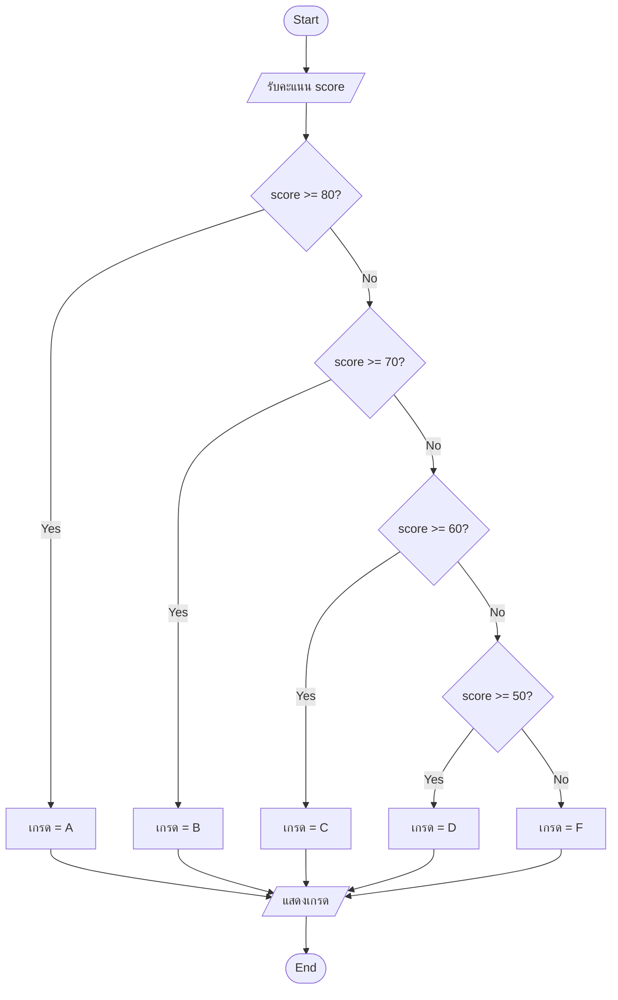
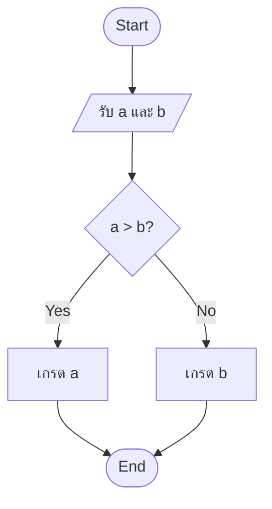
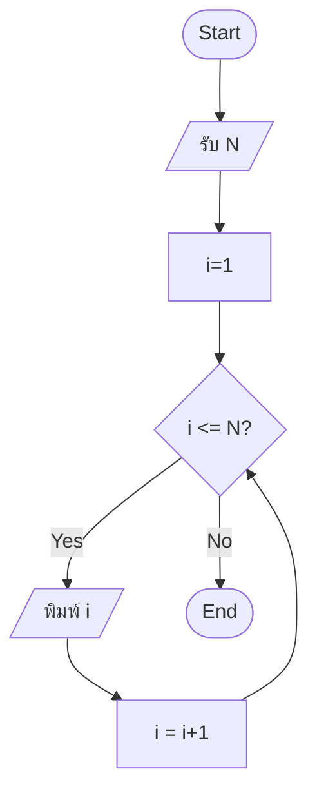

เอา Ex01 มาเขียนใหม่ โดยใช้รูปแบบ

BEGIN [ชื่อ algorithm]
INPUT ...
IF ... THEN
...
ELSE
...
END IF
OUTPUT ...
END

โจทย์ A — ตรวจสอบเกรด

BEGIN [Grade Calculator Algorithm]
INPUT score >= 80 THEN grade = "A"
ELSE IF score >= 70 THEN grade = "B"
ELSE IF score >= 60 THEN grade = "C"
ELSE IF score >= 50 THEN grade = "D"
ELSE grade = "F"
END IF
OUTPUT grade

โจทย์ B— หาค่าสูงสุดจาก 2 ตัวเลข

BEGIN [หาค่าสูงสุดจาก 2 ตัวเลข]
INPUT a , b

IF a > b THEN เกรด a

ELSE เกรด b

END IF

END

โจทย์ C — นับ 1 ถึง N

BEGIN [นับ 1 ถึง N]

INPUT N

i = 1

IF  i <= N THEN

    พิมพ์ i

    i = i + 1

ELSE 

END IF

END
